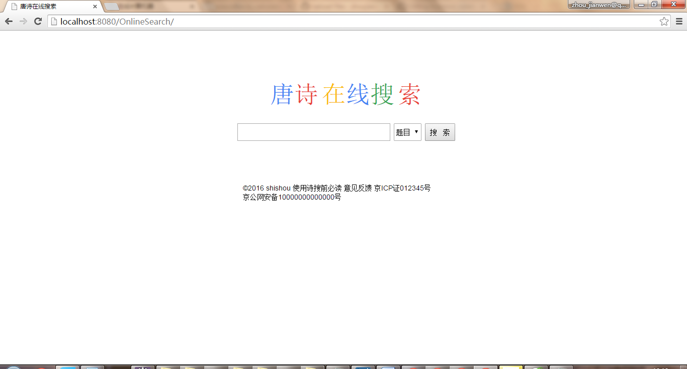

##1.使用JSP开发全唐诗搜索小网站

使用JSP＋JDBC＋MySQL实现一个全唐诗搜索的小网站。在Eclipse中创建一个Web项目并配置好JSP环境，数据库使用资料包中提供的全唐诗数据。
功能：1、实现通过作者搜索该作者所有的作品。例如搜索“李白”，显示“《望庐山瀑布》、《行路难》、《蜀道难》、《将进酒》。。。”，以列表形式显示
2、实现诗词名称搜索唐诗全文并显示
3、实现通过诗歌的名句搜索该唐诗的作者、题目和全文


运行截图：


[源代码](SoundCode/1)

mysql version 最好是5.7.9，不然数据库导入可能会出现各种问题。

##2.开发完整计算器
解题提示
1.使用JavaScript开发带界面可操作的完整计算器(可计算sin cos等三角函数)，根据用户的按钮给出结果，要求在Chrome浏览器下通过测试即可。

想利用js实现一个计算器，看起来很普通的例子，没想到折腾了几天也没有做出来。一开始我只考虑到实现算术表达式的计算就可以了，却没有想到忽略了算术表达式合法性的判断。由于我没有学过编译原理，对语义语法分析不太懂，看来有空要看一看编译原理的相关书籍才行，真是书到用时方恨少。
现在贴上js算术表达式计算的核心代码：
```javascript
// 运算符
optrIndex = {
	'+' : 0,
	'-' : 1,
	'*' : 2,
	'/' : 3,
	'(' : 4,
	')' : 5,
	'#' : 6,
	'sin':7
};

var opndStack = [];// 操作数的存储栈
var optrStack = [];// 操作符的存储栈

// 返回比较optrStack栈顶元素与arg元素的优先级
function Precede(optrStack, arg) {
	if (!optrStack.length) {
		return false;
	} else {
		
		if(!(arg instanceof Array))// 如果参数是数组对象则代表是一元运算符["sin",x]
		{
			var a = optrIndex[optrStack[optrStack.length - 1]];
			var b = optrIndex[arg];
			return relation[(a * 7) + b]; // (a行*列数7)+b列数 = 目标地址
		}else{
			return "$";
		}
	}
}

/*
 * function:表达式求值函数 args:传入表达式数组字符串 ，如new Array('3.8','+','2.5')
 */
function EvaluateExpression(str) {

	var temp;
	var n = 0;
	// 验证非负整数（正整数 + 0） ^\d+(.[0-9]{1,10})?$
	// 验证非正整数（负整数 + 0） ^((-\d+)|(0+))+(.[0-9]{1,10})?$
	// 匹配有1-10位小数的正实数 new RegExp("^[0-9]+(.[0-9]{1,10})?$")
	var reg 
	reg = new RegExp('^(-?\\d+)(\\.\\d+)?$');
	temp = str.shift();
	optrStack.push(temp);// 压入起始符'#'
	temp = str.shift();// 读取表达式的第一个字符串
	try{
	while (temp != '#' || optrStack[optrStack.length - 1] != '#') {

		if (reg.test(temp)) { // 不是运算符则进栈
			opndStack.push(parseFloat(temp));
			temp = str.shift();
		} else {
			switch (Precede(optrStack, temp))// 若是运算符则进行优先级判断再进栈或出栈的操作
			{
				case '<':// 运算符则进栈
					optrStack.push(temp);
					temp = str.shift();
					break;
				case '>':
						// 二元操作
					var theta = optrStack.pop();
					var b = opndStack.pop();
					var a = opndStack.pop();
					var operFn = getOperatorFunction(theta);
					var result = operFn(parseFloat(a), parseFloat(b));
					opndStack.push(result);
					break;
				case '$':// 如果temp参数是数组对象则代表是一元运算符["sin",x]
						// 一元操作
						var operFn = getOperatorFunction(temp[0]);
						var result = operFn(parseFloat(temp[1]));
						opndStack.push(result);
						temp = str.shift();
						break;
				case '=':
					optrStack.pop();
					temp = str.shift();
					break;
			}
		}

	}
	}catch(e)
	{
	   alert(e);
	}
	return opndStack.pop();
}

/*
 * function:返回计算的处理函数 args:传入操作运算符号
 */
function getOperatorFunction(opstr) {
	switch (opstr) {
	case '*':
		return function(a, b) {
			return a * b;
		}
		break;
	case '/':
		return function(a, b) {
			if (!b) {
				return 0;
			} else {
				return a / b;
			}
		}
		break;
	case '+':
		return function(a, b) {
			return a + b;
		}
		break;
	case '-':
		return function(a, b) {
			return a - b;
		}
		break;
	case 'sin':
		return function(a) {
			return Math.sin(a);
		}
		break;
	case 'cos':
		return function(a) {
			return Math.cos(a);
		}
		break;
	case 'tan':
		return function(a) {
			return Math.tan(a);
		}
		break;
	
	}
}

Test Data : #3.1-2+5*tan(90)-2#
alert(EvaluateExpression(new Array('#','3.1','-','2','+','5','*',['tan',90],'-','2','#')));
```

对于算术表达式合法性的判断，有兴趣的朋友可以参考这个链接http://blog.csdn.net/lisonglisonglisong/article/details/39831571


现在只能利用普通的方法去做了,实现例子在[源代码](SoundCode/2)
